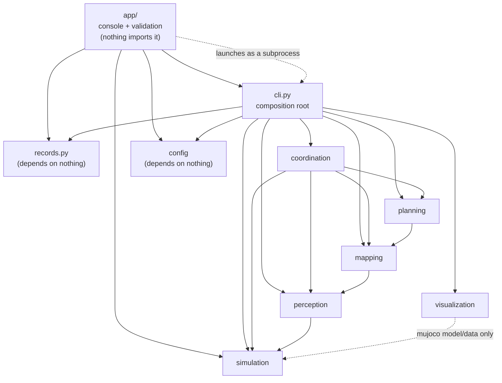

# Design document — cooperative swarm mapping

**Status:** Sprint 3 (robustness — the swarm survives losing a drone). Sections
1–4 and 5.1–5.7 were written at the close of Sprint 2's Feature 6; Sprint 3
added failure injection and detection (§5.8), run records and an operator
console (§5.9), and updated §§2, 4, 6, 7, 8 and 9 to match. Where a Sprint-2
passage has since been overtaken, [`progress.md`](progress.md) has the later
measurement.

This document describes the architecture and — more importantly — the reasoning
behind it. The running decision log is [`progress.md`](progress.md); the
per-feature plans are in [`sprint-2/`](sprint-2/) and [`sprint-3/`](sprint-3/),
indexed by [`sprint-3-plan.md`](sprint-3-plan.md). Where those disagree with the
code, the code wins and this document follows the code.

---

## 1. Purpose and scope

A swarm of 1–5 drones explores an unknown environment in MuJoCo and produces a
shared **2.5D map**: a 2D occupancy grid plus a per-cell height, exported as
`.npz` (data) and `.png` (human inspection). The drones decide for themselves
where to go; there is no scripted route.

The project's subject is **autonomy**, not perception or control: where drones
go next, how they divide the space between them, and how they avoid each other.
Everything that would compete with that for attention is deliberately excluded.

| Out of scope | Why |
| --- | --- |
| SLAM / pose estimation | Poses come from MuJoCo state via `GroundTruthLocalizer`. Localization error is a different research problem; admitting it would make every exploration result a measurement of the estimator instead. The `Localizer` seam keeps the door open. |
| 3D voxels, point clouds | The map is a 2D grid plus a height channel. Planning happens in one horizontal plane, so the third dimension buys nothing and costs memory and a planner rewrite. |
| Physics-based flight | Movement is teleport: one cell-step per tick, `mj_forward` only, never `mj_step`. Dynamics would introduce tuning, controller failure modes and float-order nondeterminism, none of which is the subject. |
| Peer-to-peer / auction coordination | One `CentralizedMaster` orchestrates everything. The `Coordinator` seam exists so a `DistributedAuction` *could* be added; it is explicitly not built. |
| Threading, async, queues | The tick loop is synchronous and sequential. Determinism is a hard requirement (§6) and concurrency is the cheapest way to lose it. |
| Wind, outdoor | Not built. Failure injection, originally listed here, arrived in Sprint 3 (§5.8). |
| Drone recovery / rejoin | Failure is permanent (Sprint 3, locked decision 2). Nothing in the KPIs needs a drone to come back. |

Scale is bounded on purpose: **1–5 drones**. Every algorithm here is chosen for
correctness and legibility at that size, not for asymptotics. `NearestFrontier`
runs a full A\* per candidate frontier per re-selecting drone; that is the wrong
answer at 50 drones and the right one at 3.

**Environment:** Python 3.13+ (`pyproject.toml` pins `requires-python >=3.13`;
CLAUDE.md's "3.11+" is the floor, not what CI runs), MuJoCo, numpy, Pillow,
PyYAML. Streamlit only in the optional `ui` extra, for the operator console
(§5.9). `uv` for dependencies, `ruff` for lint and format, `mypy --strict` for
types, `pytest` for tests.

---

## 2. Architecture

Seven modules, each with one responsibility and a named interface at its edge.

| Module | Responsibility | Interface(s) | Key types |
| --- | --- | --- | --- |
| `config` | Load and validate a scenario YAML at startup; fail fast | `parse_config` / `load_config` | `ScenarioConfig` and six frozen sub-configs |
| `simulation` | Wrap MuJoCo: inject drone bodies, report poses, cast rays, teleport; inject scripted failures | `Localizer`, `RayCaster` | `SimulationEngine`, `Pose`, `RayHit`, `FailureMode`, `FailureInjector` |
| `perception` | Turn raw ray hits into world-frame observations; filter teammates | `Sensor` | `Rangefinder`, `RayObservation`, `ScanResult` |
| `mapping` | Maintain the 2.5D grid by Bayesian log-odds update; detect frontiers; export | `Mapper` | `OccupancyGrid`, `FrontierRegion` |
| `planning` | **Stateless.** Given map + drone cell + claimed frontiers, return a frontier and a path | `FrontierStrategy`, `PathPlanner` | `NearestFrontier`, `AStarPlanner`, `FrontierAssignment` |
| `coordination` | Orchestrate the mission: tick loop, assignment, collision avoidance, failure detection, termination | `Coordinator` | `CentralizedMaster`, `DroneState`, `DroneHealth` |
| `visualization` | Read-only live view for a human | `Renderer` | `LiveViewer` |

`cli.py` is the composition root: it is the only module that imports from all of
them, and it owns the `while` loop, the tick cap and the reporting. That is
deliberate — `Coordinator.tick()` advances exactly one step so the viewer can
render between ticks and tests can inspect intermediate state, which a `run()`
inside the coordinator would foreclose.

Sprint 3 added two pieces outside the seven domain modules, one on each side of
`cli.py`:

- **`records.py`, below `cli`.** Owns the format of the two files every run
  leaves behind, `log.jsonl` and `run.json` (§5.9). It imports no domain
  module — it serialises plain data it is handed — so reading a run history
  never imports the simulator, and nothing in it can perturb a mission.
- **`app/`, above `cli`.** The operator console and the scenario validator
  (§5.9). A new top layer, flagged as a new module in the sprint plan because
  no existing one fits: `visualization` is read-only by definition, and a
  console *starts* runs. **Nothing imports `app`.** It launches missions as a
  subprocess of the CLI rather than calling into it, so the only way a mission
  executes is still `cli.py`.

### 2.1 Dependency direction

Dependencies run one way. The graph below is the **actual import graph**, read
off `src/`, not the idealized one:



Three notes on edges that differ from the idealized picture, all of them
acyclic and none of them a violation of the principle. (Until Sprint 3,
CLAUDE.md's own graph drew the first of these backwards and gave
`visualization` edges it does not have; it now matches this one.)

- **`mapping` imports `perception.types`.** `Mapper.integrate_scan` takes a
  `ScanResult`, so the data type flows *up* into `mapping` even though the data
  itself flows down. `perception` never imports `mapping`; it is grid-ignorant
  by design, emitting world-frame rays and letting the mapper decide which cells
  they cross.
- **`coordination` imports `mapping` and `perception` as well as `planning` and
  `simulation`** — it holds the `Mapper` and calls `Sensor.scan`. It sits at the
  top of the graph, so this is still one-way.
- **`visualization` imports no domain module at all.** `LiveViewer` wraps
  MuJoCo's passive viewer over the `MjModel`/`MjData` the engine already owns,
  so watching the swarm needs no read access to the map or the coordinator.

And two on the Sprint-3 layers:

- **`app` imports `cli`, but only for validation.** `app/validation.py` calls
  `build_mission` and `resolve_scene_path` so that a scenario is checked by the
  same code that will run it (§5.9); a second copy of those rules would drift.
  Running a mission is a different matter: the console builds a CLI command
  line and launches it as a child process (the dashed edge), never
  `run_pipeline` in-process.
- **Only the console imports Streamlit.** `import swarm_mapping` — and
  `app.runner`, `app.history`, `app.validation` — works without the `ui`
  extra, which a test proves in a fresh interpreter with Streamlit blocked.

**What enforces the direction:** nothing mechanical. There is no import-linter
in CI; ruff enforces style and import *sorting*, mypy enforces types. The
direction is held by review, by module docstrings that state it explicitly
(`planning/path_planner.py`: "`planning` never imports `coordination`"), and by
one structural guard — the physical drone constants live in
`simulation/engine.py` with a comment forbidding `planning` from importing them,
which is why `clearance_radius` is a *parameter* of `AStarPlanner` rather than a
lookup. Adding an automated check is listed in §9.

### 2.2 Where validation lives

`config` depends on nothing, so it can only check what is visible inside a YAML
document: required keys, types, numeric ranges, `1 <= len(start_positions) <= 5`,
and that every start position falls inside the configured grid extent. It
rejects values that are **meaningless** (a negative radius, `num_rays: true` —
`bool` is rejected explicitly because it subclasses `int` and would otherwise
run the mission with a single ray).

Values that are **unsafe** are rejected where the geometry is visible:
`min_separation` below the body diagonal in `CentralizedMaster.__init__`,
`exclusion_radius` below the body corner radius in `Rangefinder.__init__`,
`clearance_radius` too large for the grid in `AStarPlanner`. Re-deriving those
floors inside `config` would mean `config → simulation`, which the dependency
direction forbids. The split is the design, not an oversight.

The originally planned check "the grid covers the scene" was **dropped** for the
same reason: the scene's extent lives in the MJCF, and reading it would be the
exact violation this section exists to avoid.

---

## 3. The four SOLID seams

A seam is an interface that exists because a second implementation is plausible
and the consumer should not care which one it has. The project names four, and
treats them as stability points: changing one is flagged explicitly (Feature 6
widened `Coordinator`, and said so in its plan before doing it).

All four are `typing.Protocol`, not ABCs — structural typing means an
implementation does not inherit from anything, and a test double is any object
with the right methods.

| Seam | Module | Abstracts | Today | A second implementation |
| --- | --- | --- | --- | --- |
| `Localizer` | `simulation` | Where a drone is | `GroundTruthLocalizer` (reads `data.xpos` / `data.xquat`) | A SLAM estimator. Out of scope, but the seam is why adding one would not touch `perception` or `coordination`. |
| `Sensor` | `perception` | What a drone observes | `Rangefinder` (horizontal ray sweep, 72 rays) | A depth camera or stereo pair. Its signature is `scan(drone_id) -> ScanResult` — a drone id, not a pose, so a sensor is free to obtain whatever state it needs. |
| `FrontierStrategy` | `planning` | Which frontier to go to next | `NearestFrontier` (true A\* cost + spreading penalty) | `InformationGainFrontier`, weighting by region size. The stretch goal, and the reason `NearestFrontier` deliberately ignores `FrontierRegion.size`. |
| `Coordinator` | `coordination` | How the mission is run | `CentralizedMaster` | `DistributedAuction`. Explicitly not built. |

Two design consequences worth recording:

**`Sensor.scan` takes only a drone id.** That is what let the teammate filter
(§5.4) be added without touching the seam: `Rangefinder` already held the engine
reference, so it could query teammate poses itself. An interface that had taken a
pose would have had to change.

**`FrontierStrategy` was deliberately *not* widened to expose a planner.** The
master needs to re-validate committed paths against the same clearance model the
strategy planned with (§5.5), which needs the planner object. Putting `planner`
on the Protocol was rejected: a strategy that scores by expected information
gain against straight-line distance has no planner, and the seam should not
demand one. Instead `CentralizedMaster.__init__` reads an *optional* `planner`
property with `getattr` and raises if it disagrees with the planner it was
handed. One `getattr`, catches the realistic mistake, leaves planner-less
strategies alone.

`PathPlanner` is an interface but **not** a named seam — it exists because
`NearestFrontier` must be testable against a stub, not because a second planner
is planned. Under the project's "no premature abstraction" rule that is the bar:
a real test-double need counts, "might be nice later" does not.

---

## 4. Data flow — one mission tick

`CentralizedMaster.tick()` runs complete phases across the whole swarm:
**observe → sense → assign → move**. Not per-drone. If sensing and moving
interleaved, drone 1 would plan against a map already containing drone 5's
newest scan while drone 5 planned against a staler one; separate phases give
every drone the same snapshot to reason about. The *observe* phase — heartbeats
and failure declarations — was added in Sprint 3 and runs first for a reason
given in §5.8.

The CLI drives the tick through `Mission.tick()`, which first lets the
`FailureInjector` apply any failure scheduled for that tick and then calls
`master.tick()`. That is the one place the failure schedule meets the loop, and
it sits in `cli`, not in `coordination`.

```mermaid
sequenceDiagram
    participant CLI as cli.run_pipeline
    participant M as CentralizedMaster
    participant S as Rangefinder (Sensor)
    participant E as SimulationEngine
    participant Map as Mapper / OccupancyGrid
    participant A as assignment.assign_all
    participant P as NearestFrontier + AStarPlanner
    participant Mv as movement.resolve_moves

    CLI->>E: FailureInjector.apply(tick) (via Mission.tick)
    CLI->>M: tick()
    Note over M,E: PHASE 0 — observe (descending drone id)
    loop each drone not yet LOST
        M->>E: heartbeat(drone_id)
    end
    M->>M: declare LOST / STUCK past a timeout; release its frontier
    Note over M,Map: PHASE 1 — sense (drones heard this tick)
    loop each drone
        M->>S: scan(drone_id)
        S->>E: get_pose(drone_id), get_pose(teammates)
        S->>E: cast_rays(drone_id, directions)
        S-->>M: ScanResult (teammate hits re-encoded as short MISSes)
        M->>Map: integrate_scan(scan)
        Note right of Map: bresenham per ray;<br/>free along, occupied at endpoint,<br/>height = max(height, hit_z)
    end

    Note over M,P: PHASE 2 — assign
    M->>Map: get_frontiers()
    Map-->>M: FrontierRegion[] (>= min_frontier_size, sorted)
    M->>A: assign_all(grid, frontiers, states, strategy, planner, max_wait_ticks)
    A->>P: clearance_mask(grid)
    A->>A: pass 1 — keep valid assignments, claim their regions
    loop pass 2, each unassigned drone (descending id)
        A->>P: select(grid, frontiers, cell, claimed)
        P->>P: A* to every unclaimed candidate; score = cost (+ spread penalty)
        P-->>A: FrontierAssignment(region, path, cost) or None
    end
    A-->>M: new DroneState map
    M->>M: _complete / _blocked / _unreachable_frontiers

    Note over M,E: PHASE 3 — move
    M->>Mv: resolve_moves(current, desired, min_separation_cells)
    Note right of Mv: reservations seeded with CURRENT cells;<br/>descending id = higher id has right of way
    Mv-->>M: final cell per drone
    loop each drone that advanced
        M->>E: set_drone_position(id, grid_to_world(cell) + altitude)
        M->>E: get_pose(id) — read back; state follows the localizer
    end
    M-->>CLI: (tick_count += 1)
```

Step by step, with the owner of each step:

| Step | Owner | What happens |
| --- | --- | --- |
| 0. Observe | `coordination.CentralizedMaster` | Every drone not yet `LOST` is polled with `engine.heartbeat`. Missed heartbeats and unrealized moves are counted per drone; a drone past `heartbeat_timeout_ticks` or `stuck_timeout_ticks` is declared `LOST` or `STUCK` and its frontier released (§5.8). Only drones heard this tick sense; only `ACTIVE` drones heard this tick are commanded to move — a `STUCK` drone is heard and sensed but never moved again. |
| 1. Sense | `perception.Rangefinder` | Pre-computed body-frame ray directions are rotated into the world frame by the drone's quaternion; `engine.cast_rays` runs `mj_ray` with the drone's own body excluded. Each hit within `max_range` becomes a `RayObservation`; a hit landing inside a teammate's exclusion sphere becomes a MISS truncated at the sphere **entry** point (§5.4). |
| 2. Map | `mapping.Mapper` | Each observation is traced with `bresenham_2d` from the drone cell to the endpoint cell. HIT: every cell but the last gets `update_free`, the last gets `update_occupied(hit_z)`. MISS: every cell including the endpoint gets `update_free`. Log-odds increments are `+0.847` occupied / `-0.405` free, clamped to `±5.0`; height is `max(height, hit_z)` and never decays. |
| 3. Detect frontiers | `mapping.frontier` | A frontier cell is a **free** cell (p < 0.4) with a 4-connected **unknown** neighbour (0.4 ≤ p ≤ 0.6). Cells are clustered 8-connected by BFS, regions below `min_frontier_size` are dropped, and each region returns a world centroid, a representative free cell nearest that centroid, and a size. Sorted by `(row, col)`. |
| 4. Select | `planning.NearestFrontier` | For each unclaimed candidate, A\* from the drone's cell to `region.cell`; unreachable candidates are skipped. Score = integer path cost, plus `spread_penalty` if the centroid is within `spread_radius` of a claimed centroid. Ties break on `(score, row, col)`. |
| 5. Plan | `planning.AStarPlanner` | 8-connected A\* with an octile heuristic, integer costs 10/14, no corner-cutting, occupied *and* unknown cells blocked, known-occupied cells inflated by the clearance radius (§5.6). |
| 6. Resolve moves | `coordination.movement` | Each drone's desired next cell is `path[path_index + 1]`. Drones are considered in descending id order against a reservation table seeded with every drone's *current* cell; a move is taken only if the target is at least `min_separation_cells` from every reservation, otherwise the drone holds and its `waited_ticks` increments. |
| 7. Teleport | `coordination.CentralizedMaster` | `grid_to_world(cell)` plus the mission altitude is written to the drone's freejoint `qpos`; the quaternion is reset to identity, `qvel` zeroed, `mj_forward` recomputes kinematics. `mj_step` is never called during a mission — there is no contact resolution, which is exactly why the planner must model the body itself. Since Sprint 3 the master then **reads the pose back** and snaps it to the grid; `DroneState.cell` is what the localizer says, not what was commanded (§5.8). |

The mission terminates when every drone ends `_assign` unassigned
(`is_complete`) — which includes the case where no drone is `ACTIVE` any more —
when `no_progress_ticks` pass without a newly classified cell, or when the
CLI's `max_ticks` cap fires.

---

## 5. Key design decisions

### 5.1 A\* over RRT\*, potential fields, octrees and wavefront

Reviewed against the standard alternatives. **Plain A\* on the 2D occupancy
grid.** Two project constraints dissolve most of the competition's motivation:
planning is 2D (the map is a grid plus a height channel and drones hold one
altitude), and movement is teleport, so a grid path *is* the output — there is
no trajectory to smooth.

| Alternative | Why not |
| --- | --- |
| Octree / multi-resolution | Solves 3D memory scaling the project does not have; would re-architect a deliberately uniform grid for zero benefit. |
| Potential fields / navigation functions | Reactive paradigm with local minima; outputs a heading, not a path; navigation functions need the full map anyway. Clashes with a deliberative map → frontier → path pipeline. |
| RRT / RRT\* | Randomized, which breaks determinism outright, and only *asymptotically* optimal where A\* is exactly optimal on a grid immediately. Its strengths — high dimension, continuous space, dynamics — are all out of scope. |
| Wavefront | "A\* with no heuristic": floods the whole reachable grid per query. Its compute-once reuse needs many-to-one goals; here each drone has a *different* frontier. |

At `n = 2` dimensions and ≤250k cells, one `plan()` call costs single-digit
milliseconds (§5.8). Sampling planners and smoothing become relevant again only
if physics-based flight is ever added — bookmarked there, not here.

### 5.2 Frontier detection lives in `mapping`; selection lives in `planning`

Detection is a property of the map: which known-free cells touch unknown space.
Selection is a property of the robot and the mission: which of those a
particular drone should fly to, given what its teammates have claimed.

Splitting them that way is what keeps the dependency direction one-way.
If `planning` detected frontiers it would still only need read access, but
`mapping` would then own no answer to "what is unexplored" and the same grid
scan would be re-implemented by any other consumer. If `mapping` selected them
it would need to know about drones, claims and path costs — and `mapping` is the
one module that is supposed to depend on nothing.

The seam between them is `FrontierRegion`: a world centroid (for display and the
spreading penalty), a representative **free** cell (a valid A\* goal even when
the centroid itself lands on an unknown or occupied cell), and a size (unused by
`NearestFrontier`, reserved for `InformationGainFrontier`).

Clustering is a hand-written BFS with 8-connectivity, not `scipy.ndimage.label`
or DBSCAN: no new dependency, ~20 lines, and deterministic by construction. Note
the deliberate asymmetry — the frontier *test* is 4-connected (the standard
definition), while *clustering* is 8-connected so diagonally touching frontier
cells merge into one region.

**`min_frontier_size`** (added in Feature 6, on both `Mapper` and
`PlanningSettings`, set to 6 in both shipped scenarios) discards tiny regions as
noise. It exists because cells on a wall *surface* accumulate both free and
occupied evidence at grazing incidence and drift back and forth across the
0.4/0.6 classification bands, so even a finished map emits a continuous churn of
2–3 cell "frontiers" that no drone can ever clear. Filtering them at the source
is cheaper than paying A\* to rediscover every tick that each one is pointless.

### 5.3 Wait-on-conflict, higher id has right of way

The "zero collisions" KPI had no detector anywhere in the repo before Feature 4.
Half of it was already satisfied by construction — A\* traverses only free cells
and refuses corner-cutting, so a *planned path* cannot clip an obstacle. The
drone↔drone half needed a rule.

**Chosen: when two drones would occupy the same space, the lower-id drone
holds.** Not re-planning: movement is teleport, so there is no momentum and
holding costs nothing, whereas two drones re-routing around each other can
oscillate indefinitely.

Four consequences that had to be honoured in the implementation:

1. **Precedence must drive iteration order.** Whichever drone is processed first
   reserves first. An ascending walk would silently make precedence
   first-come-first-served and *invert* the stated rule. The tick therefore
   iterates **descending by id** uniformly — for sensing, for assignment and for
   movement — so there is one seniority rule rather than two orders in one tick.
2. **Reservation seeding subsumes swap conflicts.** If drone 3 steps into drone
   1's cell while drone 1 steps into drone 3's, both targets read as free under a
   naive occupancy test and the two pass through each other. Rather than add a
   second edge-conflict check, `resolve_moves` seeds its reservation table with
   every drone's **current** cell. An unprocessed drone therefore still blocks
   its own cell, and the swap can never be reserved. One conservative rule covers
   both conflict classes. The cost is that a drone occasionally waits on a
   neighbour that was about to move away anyway — an occasional tick at 1–5
   drones, in exchange for a much simpler invariant.
3. **Separation is a distance, not a cell.** At `resolution: 0.1` a cell is
   10 cm and the drone body is 30 cm, so `min_separation` is a config value in
   metres converted to a cell radius — never hardcoded to "a different cell".
   The test is radial (squared Euclidean in integer cell units against a float
   threshold), so its **floor is the body diagonal**,
   `2 × 0.15 × √2 ≈ 0.4243 m`, not the body width: two axis-aligned boxes
   overlap under a Chebyshev condition and `L∞ ≤ L₂`, so at `dx = dy = 0.2125`
   the Euclidean distance is 0.3005 (passing a 0.30 m threshold) while the boxes
   overlap by 0.0875 m. `MIN_SEPARATION_FLOOR` is enforced in
   `CentralizedMaster.__init__` and imported by the tests rather than restated as
   a literal.
4. **Deadlock escape.** Two drones head-on in a corridor would wait on each
   other forever under a pure wait rule. After `max_wait_ticks` consecutive
   blocked ticks the waiting drone drops its frontier claim and re-selects. This
   is the only place re-planning enters — as a remedy, not as the mechanism.

Three further guards came out of walking the code rather than from the design:
`min_separation` must be finite (every guard is a `<` comparison and every
comparison against NaN is `False` — a NaN threshold made `resolve_moves` block
*nothing* while its own invariant test still passed), must span at least one
cell, and start positions are checked pairwise **in cell space**, because
`world_to_grid` floors and a pair 0.43 m apart can snap to 0.25 m — two 0.30 m
bodies overlapping before tick 1.

### 5.4 The teammate filter lives in `perception`, and uses a radius

With multiple drones injected as real MuJoCo bodies, `mj_ray`'s `bodyexclude`
takes a **single** body id — the sensing drone's own — so drone 1 ranges drones
2–5 as though they were walls. Three consequences, one of them permanent:
occupancy saturates toward the `+5.0` clamp on a repeatedly-scanned stationary
drone; A\* blocks occupied cells, so a phantom obstacle can sever a corridor;
and `update_occupied` does `height = max(height, hit_z)`, which is monotonic
with **no decay**, so a drone seen at 1.0 m writes height 1.0 into a floor cell
forever. Wait-on-conflict amplifies all three by pinning the lower-id drone
stationary precisely while a teammate passes close by.

Three fixes were weighed:

| Option | Verdict |
| --- | --- |
| (a) Exclude drones at the ray-cast layer via a `geomgroup` mask | Rejected. It makes the *simulator* lie about what the sensor saw, pushing an autonomy concern into the environment model — and rays would pass straight through a teammate and map the wall behind it, which a real LiDAR cannot do. |
| **(b) Filter hit points against known teammate poses in `perception`** | **Chosen.** No seam change (`scan` takes a drone id and `Rangefinder` already holds the engine). It models what a real swarm actually does — filtering known teammate positions out of a scan using shared telemetry. Occlusion stays honest: the space behind a teammate stays unknown for that tick and is filled in on a later pass. |
| (c) Give `mapping` the drone positions so it declines to mark those cells | Rejected. Patches the end of the chain after the bad reading has travelled raycast → perception → mapper, needs the height write suppressed separately, and puts per-tick swarm awareness into the one module that is supposed to depend on nothing. |

The accepted cost of (b) is that it needs a tuned **exclusion radius** where (a)
would have needed none. Ground-truth poses are exact, so the radius absorbs body
extent only, never localization error: `DRONE_EXCLUSION_RADIUS = 0.30` covers the
box corners at `0.15 × √2 = 0.212 m` and the rotors at `0.292 m`. It is
validated in `Rangefinder.__init__` — negatives rejected (squaring silently
turned `-0.30` into `+0.30`), and any positive value below the corner radius
rejected, since that re-admits the bug the filter exists to fix. Exactly `0.0`
remains a deliberate, greppable opt-out.

**Encoding: a filtered ray becomes a MISS with a shortened range** — the
`RayObservation` type already carries `max_range` alongside `distance`, and the
mapper traces a MISS out to it. Two refinements were forced by review:

- Dropping the ray entirely would throw away legitimate free-space evidence;
  emitting a full-range MISS would falsely mark the occluded cells *behind* the
  teammate as free.
- The first implementation stopped the trace **at the hit**, but the mapper marks
  a MISS free through its *endpoint* (`bresenham_2d` is endpoint-inclusive and
  the MISS branch has no `cells[:-1]` exclusion, unlike the HIT branch). A
  discarded cell was therefore claimed *free*, not left unknown — verified at
  p = 0.3077 on the second observation. The trace now stops at the ray's
  **entry into the exclusion sphere**, the last position provably unobstructed.
  Head-on against a teammate 2.0 m away it stops at 1.70 m rather than 1.85 m.

The map-level consequence of that second bug was *overstated* in review, and the
correction is recorded honestly: the fix is right because claiming space you did
not observe is wrong and the correct version costs nothing — it is **not** known
to fix an observable map defect, because in both geometries tried the cell's
classification was dominated by other rays. The discriminating assertions live at
the observation level, not the map level (§7).

Measured effect of the filter (3 drones, 20-tick mission, 6×6 m test room —
`progress.md`, 2026-08-20):

```
filter OFF   phantom occupied cells = 0    poisoned height cells = 47
filter ON    phantom occupied cells = 0    poisoned height cells =  0
```

Occupancy self-heals — a false occupied reading needs only 2–3 later free
observations to wash out — so **a mission-level "no phantom obstacles" assertion
is vacuous**: it passes with the filter off. It was written, measured, and
deleted. The height channel is monotonic and therefore the discriminating
signal.

### 5.5 The drone has a body; the planner assumed a point

`_teleport` places the drone's *centre* on a cell centre, and the body geom is
`type="box" size="0.15 0.15 0.05"` — MuJoCo sizes are half-extents, so a
**0.30 × 0.30 m** footprint, 3 cells wide at `resolution: 0.1`. Every planning
decision treated the drone as dimensionless. A cell centre is 0.05 m from the
cell boundary, so with a wall face on that boundary the body reaches 0.15 m —
**0.10 m inside the wall**. MuJoCo never objects, because `set_drone_position`
calls `mj_forward` and never `mj_step`: there is no contact resolution to push
back. This was a latent Sprint-1 bug too; the hardcoded patrol simply never came
close enough to a wall to bite.

**Decision: configuration-space expansion in `planning`.** `AStarPlanner` takes
a clearance radius and builds an inflated-free mask once per `plan()` call.

*Not* in `mapping`: the map is a record of the world, not of the body moving
through it. Inflating the stored grid would corrupt the exported `.npz` and break
the ≥98% per-cell accuracy KPI directly. C-space expansion is a property of the
robot doing the planning.

**Square (Chebyshev) inflation is exact here, not conservative.**
`set_drone_position` resets the quaternion to identity on every teleport and no
`mj_step` ever runs, so the drone never rotates. An axis-aligned box against an
axis-aligned grid makes square dilation of the half-extent the *true* C-space
obstacle — no circumscribed-radius slack is needed, unlike the drone↔drone case
in §5.3 where the test is radial.

**The radius, exactly.** An occupied cell at Chebyshev distance `k` has its near
face at `(k − 0.5) · res`, so no overlap requires `(k − 0.5) · res ≥ h` and the
inflation radius is `r = ceil(h/res + 0.5) − 1`. At `h = 0.15, res = 0.1` that
is `r = 1` — and `r = 1` is *grazing*, 0.15 against 0.15 with zero clearance,
needing a `2r + 1 = 3`-cell (0.30 m) corridor that the drone touches on both
sides. So the configured value carries a margin: `clearance_radius: 0.20`
(half-extent plus 5 cm) gives `r = 2` at `resolution 0.1` and `r = 1` at
`resolution 0.2`. *(This corrects an earlier claim in `progress.md` that `r = 2`
was the exact requirement; the distinction is load-bearing because it is the
difference between a 0.30 m and a 0.50 m minimum doorway.)*

Three consequences that had to be decided rather than coded:

1. **Inflate only known-occupied cells, never unknown.** A frontier is by
   definition free-adjacent-to-unknown; inflating unknown space makes every
   frontier unreachable and halts exploration on tick 1. The accepted cost — a
   drone sitting on a frontier overlaps unknown space that may turn out to be
   wall — is inherent to exploration and corrects itself as the map fills in.
2. **A drone inside the zone must be able to escape.** Exempting only the start
   cell works at `r = 1` and fails at `r ≥ 2`, where every *neighbour* is
   inflated too — and `r = 2` is what the shipped `small_indoor` config produces.
   Replaced by an escape *phase*: while the search is still inside the zone it
   may move through it; once it reaches open ground it may not re-enter.
   Escaping is allowed, loitering is not.
3. **It constrains the scenarios.** `2r + 1` cells of gap is **not** sufficient,
   because a wall face landing on a cell boundary has its ray hit attributed to
   the cell on the far side — the mapped obstacle is up to one cell wider than
   the wall. Measured on a 6×6 m room at `resolution 0.25`, `r = 1`
   (`progress.md`, 2026-09-19):

   ```
   0.75 m gap (3 cells = 2r+1 exactly)  -> mapped as 2 free cells -> impassable
   1.25 m gap (5 cells)                 -> traversable; 558/576 cells mapped
   ```

   The rule for scenario geometry is therefore **`2r + 1` cells plus a cell of
   slop**, with faces cut on whole-cell boundaries. `large_indoor`'s eight
   doorways are all exactly 6 cells (1.2 m) against a 4-cell floor.

**`clearance_radius` is a required keyword argument, not a defaulted one.** The
finding this feature came from was that a body-size assumption went *unstated*;
a required argument is the one form that cannot be left unstated. Seven call
sites now say `clearance_radius=0.0` explicitly where they want a point robot,
and each of those is a visible, greppable claim rather than an accident.

**Clearance had to hold at keep-alive time, not just plan time.** Feature 4
justified keeping committed paths rather than re-planning every tick on the
grounds that "a path stays valid unless a cell it crosses stops being free" —
true before clearance existed, false after it, because inflation added a second
way for a path to become illegal. And this is the *normal* exploration case: A\*
routes only through known-free cells, so a wall discovered later was unknown at
plan time and is never itself on the path; only its inflation zone touches path
cells, which were free and stay free. Measured:

```
planned while row 0 was unknown: [(1,1) ... (7,1)]
after discovery, re-planning returns: None
is_assignment_valid said:            KEEP
```

The fix: `PathPlanner` exposes `clearance_mask(grid)`, and `assign_all`
re-checks committed paths against it. One definition of a legal cell serves both
plan time and keep-alive time, rather than `coordination` re-implementing the
body model and drifting. The smell underneath is worth naming: what the master
needs is not "the planner", it is "may the body occupy this cell" — a question
about the **body**, answered by the search algorithm because that is where the
mask happens to live. If a third consumer ever needs it, extracting a shared
body/clearance model is the move.

### 5.6 Frontier scoring: true path cost, plus a spreading penalty

**What "nearest" measures: true A\* path cost**, not Euclidean distance to the
centroid. It is wall-aware — on the Feature-3 test grid a frontier 3.0 m away in
a straight line sits behind a wall at a true cost of **104**, while one 4.0 m
away down open space costs **40**, so Euclidean scoring picks the wrong one — and
it yields **reachability for free**: an unreachable frontier returns no path and
is skipped rather than being assigned and failing a tick later. The cost is
affordable at 1–5 drones. A Euclidean-sort-then-A\*-the-top-K hybrid remains
available as a purely internal change if measurements ever demand it.

**Spreading: hard exclusion plus a soft radius.** A claimed region is never
re-selected (hard), and a candidate whose centroid falls within `spread_radius`
of a claimed centroid gets `spread_penalty` added to its *score* (soft). Neither
alone suffices: hard-exclusion-only under-spreads (two drones happily work
frontiers 0.5 m apart), soft-penalty-only permits the same frontier being
assigned twice. The penalty is **additive and integer**, in the same 10/14 units
as A\*, so ranking stays in exact integer arithmetic; and it affects **ranking
only** — `FrontierAssignment.cost` reports the true unpenalized path cost, which
keeps it honest for the path-length KPI. `small_indoor` leaves spreading off
(`spread_radius: 0.0`) because the room is small enough that distance separates
the drones by itself; `large_indoor` sets `6.0 / 40`, roughly one room's width,
because eight rooms off a corridor cross is exactly the layout where two drones
chase the same doorway.

**The claimed list is what makes assignment a swarm decision** rather than N
independent ones. `assign_all` runs in two passes: pass 1 collects drones whose
existing assignment is still valid and marks their regions claimed; only then
does pass 2 select for the rest. A single pass would let a drone pick a frontier
another drone is already flying to, because that frontier would not yet be
claimed.

### 5.7 Grid resolution is a scenario choice with measured consequences

`large_indoor` runs at `resolution: 0.2`, not `small_indoor`'s `0.1`. Measured
cost of one `plan()` call over the 50×50 m scene (`progress.md`, 2026-09-19):

```
res=0.1   500x500 (250,000 cells)  r=2  mask= 6.0ms  plan= 6.9ms
res=0.2   250x250  (62,500 cells)  r=1  mask= 0.3ms  plan= 3.1ms
```

The clearance mask is 20× more expensive at 0.1 — `r = 2` means two dilations
over a 500×500 array — and `plan()` runs once per candidate frontier per
re-selecting drone, so it compounds past the CI budget. The accepted cost is
that coarser cells classify wall-adjacent space less precisely, which bears on
the ≥98% accuracy KPI; that is not self-defeating, because the reference map is
produced at the same resolution, but it is the lever if the margin proves thin.
Every wall face in the scene sits on a 0.2 m lattice point which is also a 0.1 m
lattice point, so dropping the resolution needs no geometry change.

The `large_indoor` geometry was **generated from exact rational arithmetic, not
typed**: 24 wall segments with door gaps is enough arithmetic that one
transposed digit would produce a doorway one cell narrow — invisible in the
MJCF, and surfacing much later as a room the swarm never enters. The generator
asserted lattice alignment on every face before emitting, and the committed
tests re-assert it against the **parsed model**, because a test that greps XML
proves nothing about what MuJoCo loaded.

### 5.8 Failure handling: injected in `simulation`, detected in `coordination`

The one idea Sprint 3 hangs on: **the master never reads the failure
schedule.** A coordinator that is told which drone failed has detected nothing.
It has to infer failure from what a real ground station would see — silence, or
commanded moves that did not happen.

So the two halves live on opposite sides of the dependency graph:

- **Injection** is in `simulation`. `SimulationEngine.fail_drone(id, mode)`
  fails a drone permanently; `FailureInjector` applies a scenario's
  `failures:` schedule, sorted by `(tick, drone_id)`, before the scheduled tick
  runs, and logs `failure_injected`. A failed drone's motors ignore
  `set_drone_position` in both modes — the command is dropped, not rejected,
  because the caller cannot know the drone failed, and finding that out is the
  point. A schedule naming a drone that is not in the run (say, after a
  `--drones` override) is a `ValueError` at startup: the alternative is a
  failure scenario that quietly runs with no failure, and a recovery check that
  passes for the wrong reason.
- **Detection** is in `coordination`. `CentralizedMaster` takes no schedule —
  its constructor has no parameter for one, and a test asserts that — and its
  diagnosis is a separate type, `DroneHealth` (`ACTIVE` / `LOST` / `STUCK`), not
  the simulator's `FailureMode`. Tests compare the two; the master only ever
  sees symptoms.
- `config` stays dependency-free: it validates `mode` as a string in
  `{"silent", "stuck"}`, and `cli` maps it to `FailureMode`.

The diagnosis reaches the outside as `health` on the frozen `DroneState`, which
`Coordinator.drone_states` already exposes — so the `Coordinator` seam's
signature did not change.

**Two failure modes, two detectors.** Both modes ignore motion commands. They
differ in what the drone still *reports*, which is exactly why each needs its
own detector:

| Mode (injected) | What the simulator does | What the master observes | Diagnosis | Timeout |
| --- | --- | --- | --- | --- |
| `silent` — crash, comms loss | no heartbeat, no scan, no motion | `heartbeat()` returns False | `LOST` | `heartbeat_timeout_ticks` consecutive missed heartbeats |
| `stuck` — motor fault | heartbeat and sensor continue; moves do not happen | a granted, commanded step that the localizer says did not happen | `STUCK` | `stuck_timeout_ticks` consecutive unrealized moves |

Both timeouts are **required** keys under `coordination`, set to 3 in every
shipped scenario, and must be **≥ 1** — in `config` and again in
`CentralizedMaster.__init__`. There is deliberately no value that switches
detection off: a missing key is a startup error, not a silent default.

The two modes declare at different latencies for the same timeout of 3 — silent
in 2 ticks, stuck in 3 — because of where each piece of evidence is counted. A
missed heartbeat is counted in `_observe` on the very tick the failure is
injected, so the third miss and the declaration fall on injection tick + 2. An
unrealized move is counted in `_move`, at the end of a tick, and only weighed by
the *next* tick's `_observe`, so the third one is declared on injection
tick + 3.

**Tick order: observe → sense → assign → move.** Declarations happen in the
new `_observe` phase, which runs *first*. That ordering is what lets a failure
declared on tick *t* release its frontier before tick *t*'s own assignment
pass hands frontiers out, so a teammate can take it up on the declaring tick.
Declaring at the end of `_move` instead would have added a tick of latency to
every reassignment. A test pins this: moving `_observe` after `_assign` makes
`test_the_released_frontier_is_handed_out_on_the_declaring_tick` fail. It is
also why detection latency *is* reassignment latency here (§8).

**The master trusts the localizer, not its own commands.** Before Sprint 3,
`_move` teleported a drone and wrote the *commanded* cell straight into
`DroneState.cell`. That was a latent bug independent of failure: the master's
belief about where a drone is should come from the `Localizer`, not from a log
of what it asked for. It had never bitten because a healthy teleport always
lands. Now `_move` teleports, reads the pose back through
`SimulationEngine.get_pose` (which delegates to `GroundTruthLocalizer`), and
snaps it to the grid. If the drone did not arrive, the state follows the
localizer, the path does not advance, and the unrealized-move count goes up.
For a healthy drone the read-back is exact — a cell centre round-trips through
`world_to_grid` — so every run without failures had to reproduce its earlier
tick count exactly. It does: `small_indoor` at 1/2/3 drones runs 498/254/197
ticks with identical coverage and identical map hashes before and after the
change, and `tests/integration/test_zero_regression.py` guards the ticks and
coverage on every push.

Four rules that had to be decided rather than coded:

1. **No heartbeat ⇒ no action.** A drone that missed its heartbeat sent no
   telemetry, so there is no scan to integrate and it is not commanded that
   tick. That also means no motion evidence accumulates, so a silent drone can
   never be misdiagnosed as stuck. The accepted consequence: until it is
   declared, a silent drone is still `ACTIVE` and keeps its claim — that hold,
   at most `heartbeat_timeout_ticks` long, *is* the latency the KPI measures.
   Within that window the assignment pass may even hand it a new claim if its
   target evaporates; that claim is released on declaration like any other.
2. **Waiting is not stuck.** The unrealized counter counts only moves that
   `resolve_moves` *granted* and the drone then failed to make. A drone holding
   position to yield to a teammate was never commanded to move, so yielding can
   never look like a fault. `test_a_yielding_drone_is_never_stuck` needed its
   start positions moved closer (0.75 m → 0.5 m) before any drone actually
   yielded — at 0.75 m the mission produced zero wait-ticks, and the test
   would have passed vacuously.
3. **A `STUCK` drone keeps sensing; a `LOST` one does not.** The stuck drone's
   heartbeat and sensor still work, so its scans still reach the map before and
   after declaration. It is never commanded again. A `LOST` drone is not
   polled again at all.
4. **A failed drone is a static body.** It is never assigned, never counted as
   idle and never sent home, but it stays in `resolve_moves`'s reservation table
   with its last cell, so no teammate comes within `min_separation` of the
   wreck.

**Wrecks are planned around in an overlay, never written to the map.** A failed
drone in a doorway would otherwise leave teammates planning straight through
it. The map deliberately contains no drones — that is what the teammate filter
(§5.4) is for, and the ≥98% accuracy KPI depends on it — so the wreck goes into
a **planning-only copy** of the grid: `_planning_grid()` marks each wreck's
footprint at +2.0 log-odds, well past the occupied band, using the same overlap
rule as clearance inflation (`k = ceil(h/res + 0.5) − 1`, which is 1 cell at
every shipped resolution). Assignment and return-to-base routes plan on that
copy; the exported map never sees it, and a test asserts so. One benign
exception is documented at the call site: the overlay also reaches the
frontier-cell set `assign_all` uses to decide whether a committed target still
exists, which can only drop frontiers under a wreck's footprint — unreachable
anyway. The accepted cost is a full grid copy on every tick a wreck exists
(and one more per return-to-base route planned).

**The whole swarm lost.** When no drone is `ACTIVE`, every state holds no
assignment, so the mission completes through the existing `is_complete` path —
reported `blocked` if frontiers remain — and logs `swarm_lost` once. No special
termination code, no infinite loop on an empty swarm.

**A stuck drone that is never commanded is undetectable — by design.** Stuck
detection needs a commanded move to fail. A drone whose motors jam while it has
nowhere to go produces no symptom, and a motor fault on an idle drone harms
nothing. That case is reported as "undetected (never commanded)", not as a KPI
miss. This is why both failure scenarios fail drone 1 at tick 300, when it holds
a target.

**What a tick is worth in seconds (D1).** The KPI is "< 2 s", but a tick had no
duration: `tick()` never advances MuJoCo time and a step is a one-cell
teleport. `drones.cruise_speed` (m/s, required) gives it one:
`ScenarioConfig.tick_seconds = map.resolution / cruise_speed`. Timeouts stay in
ticks, matching every other `*_ticks` setting. At 1.0 m/s on `large_indoor`'s
0.2 m cells a tick is 0.2 s, so the KPI is < 10 ticks. The seconds are
**nominal** — derived from a configured speed, not from simulated physics —
and that is the honest reading of any latency figure quoted in them.

### 5.9 Run records and the operator console

**Every run records itself.** Whether launched from a terminal or the console,
`run_pipeline` writes into its `--output` directory:

| File | What it is |
| --- | --- |
| `log.jsonl` | Every log record the `swarm_mapping` logger tree emitted at INFO and above, one JSON object per line, each with `event` and `tick`. This is CLAUDE.md's logging convention ("JSON Lines, per-run output directory"), which the stderr-only logging of Sprints 1–2 never met. |
| `run.json` | Schema version, start time, the run's **inputs** (resolved config path, a snapshot of the `ScenarioConfig` actually run with CLI overrides applied, drones flown, assignment, target tolerance, variant label, view) and **outputs** (ticks, coverage, blocked, unreachable frontiers, tick-capped, succeeded, wall seconds, per-drone path stats, event counts, files written). Written atomically. |
| `map.npz`, `map.png` | The 2.5D map, as before. |
| `paths.json`, `route_drone_<id>.png` | Each drone's path, always written, so every run in the history can show its routes. |
| `visits_drone_<id>.png` | Only with `--visit-heatmaps`. |

Event names are machine names matching `^[a-z][a-z0-9_]*$`, which a test
enforces on every line and every `event_counts` key: `mission_started`,
`mission_progress`, `failure_injected`, `drone_failed` (with `drone_id`,
`health`, `tick`, `released`), `swarm_lost`, `assignment_dropped`,
`frontier_exhausted`, `returning_to_base`, `mission_blocked`,
`mission_stalled`. The first cut used the CLI's prose messages as event names,
so every "Tick 50/…" line became its own key; review caught it, and the fix
names the event with an `event` extra while leaving the stderr text unchanged.
`tick` in a log line means ticks *completed* when it was written — the master's
own convention — so a stamped tick and a caller-supplied one agree.

**Determinism reaches the logs.** Log lines carry no timestamps, so two runs of
the same inputs produce **byte-identical `log.jsonl`** as well as identical
maps. The only wall-clock readings in a record are `started_at` and
`wall_seconds`. The test that re-runs a run from its own record asserts
identical map bytes, identical log bytes, and an identical record apart from
those two fields and `config_path` (the replay reads a copy of the file). `run.json`'s config snapshot is `asdict` of the
parsed config, so it is not itself loadable as a scenario YAML (two keys are
spelled differently); `config_path` plus the recorded overrides re-run it.

**A run that fails validation leaves nothing behind.** `run_pipeline` loads the
config, applies overrides and builds the mission *before* creating the output
directory, so a bad config produces an error and no half-written run.

**Validation runs on the compiled scene.** `app.validate_scenario` never
raises; it returns a list of problems. In order: the config must load; the
scene file must exist (checked before MuJoCo is touched); optionally, exactly
five start positions must be declared; every spawn is placed in the real
MuJoCo scene and **every contact between a drone and scene geometry** becomes a
problem naming the spawn index and the geoms; finally `build_mission` must
succeed, which enforces spawn separation through `CentralizedMaster`. Each rule
is checked by the component that already owns it rather than re-implemented,
because a second copy would drift. One stated gap: a geom with `contype=0` and
`conaffinity=0` produces no contacts, so a spawn inside one would pass. No
shipped scene has one.

**Installing a room never overwrites.** An uploaded room is a config plus its
MJCF scene — a config alone could only point at a scene that already exists.
`install_scenario` requires a name matching `[a-z][a-z0-9_]{0,40}` in full (no
`/`, no `.`, so it cannot climb out of either root), refuses if anything by
that name already exists, validates the upload in a temporary directory with
**five spawns required** ("can spawn up to 5 drones" means every one of five is
usable), and only then writes the scene and config with exclusive-create
opens. If the final write fails, the scene it already wrote is removed. An
invalid upload writes nothing.

**The console is the CLI, in a subprocess.** `swarm_mapping.app` is a
Streamlit console with three pages — **Run**, **Scenarios**, **History** — and
it never runs a mission in-process. The Run page builds the same argument list
a user would type (`python -m swarm_mapping.cli --config … --output …
--drones N --assignment … --target-tolerance …`, plus `--view` when asked) and
launches it as a child process into its own `runs/<timestamp>_<scenario>_<variant>_<N>d/`
directory, with the child's stdout and stderr in `console.txt`. Three things
follow: a console run is byte-identical to the same CLI run, the MuJoCo viewer
gets its own process, and the UI cannot perturb the mission. The four
allocation variants are labelled as allocation variants, not strategies — Sprint
2.5 showed `FrontierStrategy` is not what they change:

| Label | `coordination.assignment` | `target_tolerance_cells` |
| --- | --- | --- |
| baseline | `greedy` | 0 |
| A | `global` | 0 |
| B | `greedy` | 3 |
| A+B | `global` | 3 |

The logic lives outside the UI: `app/runner.py` (argument list, run
directories, launch) and `app/history.py` (table rows, run comparison, log
parsing) are plain Python with their own tests; `console.py` is layout only. A
test checks the runner's flag spellings against the CLI's own parser, so the
two cannot drift.

**Streamlit is an optional extra.** It is a heavy dependency, so it lives in
`[project.optional-dependencies] ui` and never in the core install: the
simulator and CI stay as lean as before. `uv sync --extra ui`
installs it; `uv run swarm-console` starts the console, and prints the install
hint instead if the extra is missing.

---

## 6. Determinism

**Same config + same seed ⇒ identical run** is a hard requirement, not a
preference. It exists so that acceptance tests can compare against a reference,
so that a bug reproduces on the second attempt, and so that a measured KPI means
something. It is also the single constraint that rules out the largest number of
otherwise-attractive techniques: RRT\*, threading, multiprocessing, and any
iteration over an unordered container in a decision path.

Techniques actually used:

| Technique | Where | Why it matters |
| --- | --- | --- |
| **Integer edge costs** (10 orthogonal, 14 ≈ 10√2 diagonal) | `AStarPlanner`, `path_cost` | A\* compares costs exactly, with no floating-point tie ambiguity. The one definition lives in `planning` so a consumer ranking routes uses the same scale A\* minimized. |
| **Integer spreading penalty** | `NearestFrontier` | Keeps the score in exact integer arithmetic even when the penalty applies — no float comparison anywhere in the selection path. |
| **Explicit tie-breaking** | A\* heap entries are `(f, h, cell)`; candidate keys are `(score, row, col)`; frontier regions sort by `(row, col)`; region representatives break ties on `(row, col)` | Ties are resolved by *value*, never by list order or insertion order, so expansion order and the returned path are stable across runs. |
| **Sorted iteration everywhere it can be observed** | `sorted(engine.drone_ids, reverse=True)` for the tick; `sorted(states, reverse=True)` in `assign_all`; `sorted(self._engine.drone_ids)` for teammate positions; row-major `np.argwhere` order for frontier BFS seeds | Dict iteration order is insertion-ordered in CPython but not something to rely on semantically. Where the order genuinely cannot matter — the inner loop of `resolve_moves` is a boolean test, and the teammate `min` is order-independent — the code says so in a comment rather than leaving the reader to check. |
| **Deterministic clustering** | Hand-written BFS with a fixed neighbour offset list | `scipy.ndimage.label` was declined partly for this; a fixed iteration and neighbour order guarantees the same regions every run. |
| **No RNG, no wall-clock in decisions** | Whole system | The only `time.sleep` is viewer pacing, which never touches the map. `--view` is explicitly asserted not to change output. |
| **No parallelism** | Whole system | Multiprocessing the probability/frontier pass was considered and rejected: the work is a vectorized, memory-bandwidth-bound numpy pass costing ~1 ms on a 250k-cell grid, while spawn plus pickling costs ~100–300 ms — a 100×+ regression — and a parallel split/reassemble invites ordering nondeterminism for nothing. |

Two determinism tests are in the e2e suite: two runs of the same config produce
**byte-identical `.npz`**, and two runs agree on the whole `MissionResult`.

Sprint 3 extended the discipline to the two new things that could have broken
it:

| Technique | Where | Why it matters |
| --- | --- | --- |
| **Scripted failures, no RNG** | `FailureInjector` | Failures fire at ticks written in the scenario YAML, sorted by `(tick, drone_id)`, with `<=` so a skipped tick cannot skip a failure. A "random failure" mode would have made every failure run unrepeatable. `test_a_failure_run_is_deterministic` asserts two runs of the same failure scenario agree on tick count and on the tick each `drone_failed` fires. |
| **Detection in sorted order** | `CentralizedMaster._observe` | Heartbeats are polled and declarations made in the same descending-id order as the rest of the tick, so two drones crossing a timeout on one tick are always declared in the same order. |
| **Byte-identical run logs** | `records` | Log lines carry no timestamps and `event_counts` is sorted, so two runs of the same inputs produce the same `log.jsonl` byte for byte. Wall-clock time appears only in `run.json`'s `started_at` and `wall_seconds`, and in the console's run-directory *names* — never in a mission input. |
| **One execution path** | `app` | The console launches the CLI as a subprocess instead of calling it, so there is no second way to run a mission that could drift from the first. |

A performance note that follows from the same discipline: an available
micro-optimization (thresholding `log_odds` directly instead of calling
`probability()`, avoiding one `exp` over all N cells) was **deferred** because it
costs readability — a magic `-0.405` instead of a plain `p < 0.4` — and leaks
the grid's internal log-odds encoding into `frontier.py`, breaking a clean seam
for ~1 ms that has not been shown to matter. The recorded rule: *measure before
optimizing; don't trade a clean seam for a millisecond without evidence.*

---

## 7. Testing strategy

### 7.1 The regression / progression split

Every test module declares the sprint it was introduced in with
`pytestmark = pytest.mark.sprint(N)`. `tests/conftest.py` holds a single
`CURRENT_SPRINT` constant and derives two selectable groups from that one tag:

- **regression** — tests from sprints *before* the current one. Already-shipped
  behaviour that must not break.
- **progression** — tests from the *current* sprint: the work in flight.

At each sprint kickoff `CURRENT_SPRINT` is bumped by one and last sprint's
progression tests become regression with **no re-tagging**. A test carrying no
sprint marker escapes both labels, so `pytest_collection_modifyitems` emits a
warning naming it.

**The labels label; they do not select.** That sentence is the Sprint 3 fix
(Task 0) to a gate that had been quietly wrong since Sprint 1:

- `CURRENT_SPRINT` was still `2` after Sprint 2 and Sprint 2.5 closed, so all
  283 of their tests were still "progression", and **every push ran 103 of the
  365 tests** — Sprint 1's 82 plus sanity.
- Worse, the gates *split* the suite instead of covering it: push ran
  `regression or sanity`, PR to `main` ran `progression or sanity`. **No CI gate
  had ever run the whole suite.** A bare bump would only have moved the hole —
  the push gate would have picked up the acceptance tests, and the sprint's PR
  to `main` would have skipped every earlier test.

The gates now run **both labels on every push**, as separate steps, so a red
build still says whether shipped behaviour broke or in-flight work is not done:

| Gate | Steps |
| --- | --- |
| push (any branch) | **Regression** `-m "regression and not acceptance"`, then **Progression** `-m "progression and not acceptance"` (exit code 5, "no tests collected", is accepted so an empty progression set at sprint start passes) |
| PR → `main` | the same two, with coverage (`--cov`), then **Acceptance** `-m acceptance` |

At the switch the Regression step ran 358 tests. **Coverage is collected only
on PRs to `main`.** With `--cov` on every push, the push gate measured
**6 min 9 s** against CLAUDE.md's 5-minute per-commit budget. Without it
(PR #24), the same 358 regression tests ran in **2 min 42 s**, progression
(150 tests) in 1 min 39 s, and the whole push job in **4 min 37 s**. That
margin was thin, and Feature 11 then added a ~54 s integration module. The
first push after it (run 35653954803, the PR #25 merge into `sprint-3`) took
**6 min 15 s** from creation to completion: regression 358 tests in 2 min 42 s,
progression 202 tests in 3 min 13 s. **The push gate is over its 5-minute
budget again, even without coverage.** No decision on that has been recorded;
it is listed in §9.

**The forgotten bump now fails loudly.** It was missed twice, silently. A test
tagged with a sprint *ahead of* `CURRENT_SPRINT` now raises a
`pytest.UsageError` at collection with a message saying to bump the constant —
which is exactly the moment the first new-sprint test is written, so the
mistake is caught the first time it can happen.

Two further markers select *cost*, orthogonally to era:

- **`sanity`** — a small hand-curated set of fast cross-module health checks.
  Since Task 0 no CI step selects it (each CI step runs a whole label, and an
  empty progression step is accepted); it is used by the pre-commit hook.
- **`acceptance`** — full-scenario runs, minutes not seconds. Acceptance tests
  still carry `sprint(N)`; the marker says how expensive they are, the sprint tag
  says which era they belong to.

Runtime is a real constraint here, not a formality: `tests/integration/test_e2e.py`
alone takes ~108 s and the full suite ~113 s against CLAUDE.md's <5 min
per-commit budget, while a single `large_indoor` 3-drone acceptance run takes
~279 s (58 s after Feature 6's fixes — `progress.md`, 2026-09-20). That gap is
exactly what the `acceptance` marker is for. (Those are Sprint 2 figures; the
Sprint 3 push-gate times are above.)

**Pre-commit** runs ruff and ruff-format, basic file checks, and — when Python
files are staged — `pytest -m "(regression or sanity) and not acceptance"`.
The `and not acceptance` is a Task 0 follow-up (PR #26): once the bump made
Sprint 2 regression, the hook's old `regression or sanity` selection had quietly
grown to include the 7 acceptance tests, minutes per commit. It was found
while writing these docs and fixed in PR #26.

**The console's UI tests are deliberately not run in CI.** The console is an
optional extra, not core: it needs to work, but it is not CI-gated. CI installs
without the `ui` extra, so `tests/unit/test_app/test_console.py` — the 11
Streamlit `AppTest` tests — skips there via `pytest.importorskip`. The
plain-Python app tests do run in CI: the other 37 in `tests/unit/test_app`
(runner, history, launch) and the scenario-validation suite in
`tests/integration/`. Locally, `uv sync --extra ui` makes the UI tests run too.

### 7.2 No mocking of MuJoCo

Unit tests either avoid the simulator entirely (pure grid/planning/assignment
logic — `movement.resolve_moves` and `assignment.assign_all` are pure functions
precisely so the trickiest rules in `coordination` are testable without it) or
use a tiny inline MJCF scene. `tests/conftest.py` provides a `FakeEngine` stub
for the engine's *public interface* — not a mock of MuJoCo itself — and it is
deliberately strict: once per-drone poses are supplied, an unknown id raises like
the real engine rather than silently returning the fallback pose, because a
multi-drone fake that hands back the wrong drone's pose is a trap, not a
shortcut.

`tests/scene_truth.py` builds the map a perfect sensor would produce directly
from the **parsed** model's box geoms, for accuracy comparisons. Reading the
parsed model rather than the MJCF text is the point: a test that greps XML proves
nothing about what MuJoCo loaded.

### 7.3 The recurring lesson: mission-level metrics do not discriminate local defects

This has now been learned twice, in consecutive features, and it is the most
transferable thing in the sprint.

- **Feature 4b.** The obvious assertion was "no phantom obstacles appear at a
  teammate's position over a mission". It passes **with the bug present**,
  because a false occupied reading needs only 2–3 later free observations to wash
  out and a full mission supplies them. The test was written, measured, and
  deleted. The height channel — monotonic, with no recovery path — is the
  discriminating signal, and single-scan occupancy is asserted at the integration
  level where the artifact is still visible.
- **Feature 4c.** The plan's headline test was "no drone's body ever overlaps a
  known-occupied cell, every tick". It cannot be satisfied and does not mean what
  it sounds like: at `resolution 0.25` a 0.30 m body *always* overhangs its own
  cell by 0.025 m wherever it sits, and an occupied *cell* is up to half a cell
  larger than the wall inside it. The assertion measures grid discretization, not
  physical overlap. It was replaced by the doorway pair (§5.5), which is
  discriminating: the narrow-door case fails with clearance disabled, the
  wide-door case fails if unknown cells are inflated or the radius is one cell too
  large — both mutations verified.

Stated as a rule: **a mission-level metric aggregates over so many rays, ticks
and cells that a local defect usually washes out of it.** The assertion has to
be placed where the defect is local — at the planner, at the observation. The
mission-level test is for *liveness*, not correctness.

A corollary, from the same reviews: **a self-healing channel cannot carry a
regression test for the thing it heals from.**

### 7.4 Boundaries are where the bugs are

A multi-agent review of the clearance PR ran 22 mutations against the shipped
suite; **11 survived**. The pattern across all of them was identical: every test
sat strictly *inside* the region it was testing, never on its boundary. All
three separation guards were `<`, every rejection test used a value well inside
the rejection region and every acceptance test one well outside it — so flipping
any guard to `<=` passed. The inflation formula was exercised at ratios of 0.0,
0.8 and 1.0, none near the half-cell step, so shifting it by half a cell passed.
`_dilate`'s zero-padding was argued for in a comment and never tested, because
every fixture happens to have walls on all four borders.

The fix was a parametrized test on the *arithmetic itself* plus an exact-boundary
acceptance case per guard, importing `MIN_SEPARATION_FLOOR` rather than restating
it as `0.4243` — the rounded literal is what had hidden the boundary in the first
place.

The same reviews produced the guards in §5.3 and §5.4 that are otherwise
invisible: NaN defeating four `<` comparisons at once, a dropped
`other != drone_id` guard that would make a drone filter *itself*, and a widened
exclusion radius that the suite pinned from below but not from above.

### 7.5 Coverage

Required ≥70% on `mapping`, `planning` and `coordination`; other modules are
covered mostly via integration. Coverage is reported by `pytest-cov` in CI.
Adding trivial tests to lift the number is explicitly not the goal — the point
of writing test signatures from the design *before* implementing is that the
tests prove the contract is understood.

---

## 8. KPIs and how they are measured

| Tier | KPI | How it is measured | Status |
| --- | --- | --- | --- |
| 1 | Coverage ≥95% indoor | Fraction of grid cells classified free (p < 0.4) or occupied (p > 0.6) — `cli.coverage_fraction`. Cells inside the unknown band do not count. | `small_indoor`, 1 drone: **98.13%** measured. 3-drone e2e test asserts ≥95%. `large_indoor`, 3 drones: **97.6%** measured. |
| 1 | Map accuracy ≥98% per-cell | Per-cell classification against a truth grid built from the parsed MJCF box geoms (`tests/scene_truth.py`). | Asserted ≥98% over a 3-drone `large_indoor` mission by the acceptance test `test_classified_cells_match_ground_truth`, which passes (`progress.md`, 2026-09-20, Feature 6: accuracy "passing throughout"). The measured fraction itself is not recorded. |
| 1 | Zero collisions in nominal ops | Drone↔obstacle: guaranteed by construction (A\* traverses only free cells, refuses corner-cutting, and refuses cells inside the clearance mask — re-checked every tick against committed paths). Drone↔drone: `resolve_moves` enforces `min_separation` on end-of-tick positions. | Enforced and unit-tested, and asserted over a whole 3-drone `large_indoor` mission by the acceptance test `test_no_two_drones_ever_breach_separation`, which passes (same `progress.md` entry: separation "passing throughout"). |
| 2 | Scaling speedup ≥1.5× (1→3 drones, small indoor) | **Ticks to reach 95% coverage**, 1 drone vs 3. Deterministic and directly comparable; wall-clock was rejected because per-tick compute *rises* with drone count, so adding drones could worsen the number while the swarm genuinely explores faster. Both arms come from one config file via `--drones N`, which takes the **first N** start positions — a second config file could drift and make the KPI lie rather than fail. | **Measured on `large_indoor`, not on the scene this row names:** **2.92×** 1→3 and **4.59×** 1→5 (ticks to 95%: 2371 / 811 / 517; `progress.md`, 2026-09-20, "Scaling KPI"). The small-indoor 1→3 figure the row defines is asserted ≥1.5× by `tests/acceptance/test_scaling_kpi.py` on every PR to `main`, but its current ratio is not recorded; the last one recorded, 4.70× (221 vs 47 ticks to 95%, `progress.md`, 2026-09-20, Feature 6), predates the elevation sweep, which superseded every earlier baseline. |
| 2 | Frontier reassignment latency <2 s | Ticks from `failure_injected` to `drone_failed` (the declaration that releases the failed drone's claim), × `tick_seconds` (§5.8). Because declaration runs before the same tick's assignment pass, detection latency *is* reassignment latency. `benchmarks/failure_recovery.py`, `large_indoor`, 5 drones, drone 1 failed at tick 300. | **Met.** Silent → `LOST` in **2 ticks = 0.40 s**; stuck → `STUCK` in **3 ticks = 0.60 s**. Both < 2 s (tick = 0.2 s). Seconds are nominal (D1). |
| 1 | Coverage ≥95% indoor, **with a drone lost** | Same coverage measure, same benchmark; the mission must also reach its own terminal state, not `max_ticks`. | **Met.** **97.37%** in both failure modes — equal to the healthy run. Neither run was tick-capped. |
| 1 | Zero collisions, including with the wreck | A failed drone stays in `resolve_moves` as a static body; teammates plan around it on the overlay (§5.8). | Unit-tested (`test_teammates_keep_their_distance_from_the_wreck`, the wreck-routing tests). |
| 3 | Wall-clock per scenario, path length per drone, merge conflict rate, communication volume | Measured, not committed. `FrontierAssignment.cost` is kept unpenalized specifically so it remains a truthful path length. | Merge conflict rate and communication volume are structurally N/A in this architecture: one shared `Mapper`, one in-process master. |

**What losing a drone costs.** Recovery is not free, and the price is in
mission length rather than coverage (`large_indoor`, 5 drones):

```
scenario            ticks  t@95%     cov   health  latency
large_indoor          894    517  97.37%        —        —
failure_injection    1289    579  97.37%     lost   2 ticks = 0.40 s
failure_stuck        1369    579  97.37%    stuck   3 ticks = 0.60 s
```

Total ticks rise **+44%** (silent) and **+53%** (stuck); time to 95% coverage
rises **+12%** in both. The swarm reaches the coverage target nearly on time and
spends the extra ticks on the tail. An integration test on `small_indoor`
(drone 2 failed at tick 40, 3 drones; ~54 s) guards the same behaviour on every
push: it asserts the latency is under 2 s and coverage stays ≥95%.

**`--drones N` never invents a start position.** A fabricated one would have to
be collision-free, inside the grid, and `min_separation` clear of its
neighbours; a CLI flag guessing at that is exactly the silent safety failure the
codebase keeps refusing. `N > len(start_positions)` and `N < 1` are both errors
naming both counts.

### 8.1 Reading `is_blocked` — it is not pass/fail

`run_pipeline` returns a frozen `MissionResult` (`ticks`, `coverage`, `blocked`,
`unreachable_frontiers`, `tick_capped`, `npz_path`, `png_path`) rather than
printing it, because outcome assertions should not have to parse stdout.

The important subtlety: **`is_blocked` fires on successful runs.** Body-clearance
inflation leaves wall-adjacent frontiers that are permanently *visible* but
permanently *unoccupiable*, so a fully successful mission normally terminates
blocked. Measured on `small_indoor` with one drone: **371 ticks, 98.13%
coverage, `blocked=True`, 3 unreachable regions.** Of 749 unknown cells out of
40 000:

```
unknown inside obstacle footprints: 425
unknown within 0.5 m of a wall:     324
unknown elsewhere:                    0
```

Zero elsewhere — the map is as complete as clearance physically permits. The
first cut of the CLI exited non-zero on `blocked` and would therefore have failed
the happy path at 98.1% coverage. `MissionResult.succeeded` is now
`not tick_capped` only; `blocked` is *reported*, with its frontier count, for the
operator to weigh against coverage. What separates residue from a real wall is
**magnitude**: 3 regions at 98% is residue, 200 regions at 58% is a wall. The
contrasting measurement, from the clearance work:

```
wide doorway (5 cells)   complete=True blocked=False unreachable=0 known=96.9%
narrow doorway (3 cells) complete=True blocked=True  unreachable=2 known=58.0%
```

`is_blocked` and `unreachable_frontiers` were added to the `Coordinator`
Protocol in Feature 6 — a deliberate change to a named stability point, flagged
in the feature plan before it was made. The justification: a coordinator that can
report only that it *stopped*, and not what it stopped with, is under-specified,
and a `DistributedAuction` would owe the same answer.

---

## 9. Known limitations and future work

**Resolved since Sprint 2** (kept so the history reads straight; details in
`progress.md`):

- **`large_indoor` now terminates.** At Feature 6 it plateaued at ~97.6% and
  ran to the `max_ticks` cap. The wall-interior hypothesis recorded here was
  measured and was *not* the cause: at the plateau every surviving frontier was
  unreachable, the frontier set never settled, and assignments were never
  re-checked against their target. The fix was a target re-check plus the
  `no_progress_ticks` stop (§4) — `progress.md`, 2026-09-20, "Finding 2
  resolved".
- **The acceptance suite exists and runs on PRs to `main`**: per-room mapped
  fraction, map accuracy, zero collisions and the scaling KPI. §8 now quotes
  what has been recorded from it.
- **`--view` with 3 drones has been run.** Watching it is how the wall-hugging,
  room-looping and loitering bugs were found (`progress.md`, 2026-09-20,
  Feature 6 addenda).

**Open, from Sprint 3:**

- **A stuck drone that is never commanded is undetectable — by design.** Stuck
  detection needs a commanded move to fail; a motor fault on a drone with
  nowhere to go produces no symptom and harms nothing (§5.8).
- **The `FrontierStrategy` seam is bypassed under `assignment: global`.**
  Carried from Sprint 2.5 (`progress.md`, 2026-09-21): in global mode
  `coordination/allocation.py` chooses the target and the strategy is handed a
  one-element list, so `NearestFrontier` only routes. Every shipped scenario
  defaults to A+B (`assignment: global`, `target_tolerance_cells: 3`), so the
  seam is bypassed in the default configuration; it selects only when a run
  overrides `--assignment greedy`.
- **The CI push gate is over its 5-minute budget again** (6 min 15 s after
  Feature 11, without coverage — §7.1). Open; no decision recorded.
- **Console UI tests run only locally**, with `uv sync --extra ui` (§7.1).
- **A browser reload loses the console's handle on a live run.** The process
  handle lives in the Streamlit session; the run still finishes and appears in
  History, but the Run page no longer tracks it and nothing stops a second run
  being launched alongside it.
- **The console's non-zero-exit warning is worded too broadly.** It says the
  mission "stopped short (blocked or tick-capped) or the run crashed", but a
  blocked run exits 0 (§8.1); a non-zero exit means tick-capped or crashed.
- **Every console rerun re-validates every scenario**, including the MuJoCo
  contact check on each scene. Not measured as a problem yet; the fix, if it
  becomes sluggish, is caching on file modification times.
- **`SWARM_ASSETS_DIR` set to a non-default directory is a test hook only.** A
  room installed there is written with a relative `scene.path`, but the CLI
  resolves relative scene paths against the bundled assets, so the room would
  then list as invalid. The default — the bundled assets directory — works.
- **`run.json`'s config snapshot is not loadable as a scenario YAML** (two keys
  are spelled differently). Re-running uses `config_path` and the recorded
  overrides; an inverse mapping was deferred until something needs "re-run
  this record".

**Structural, accepted:**

- **Nothing mechanically enforces the dependency direction.** It is held by
  review and by explicit docstrings. An import-linter rule in CI would make it
  a build failure instead of a habit.
- **`clearance_mask` sits on `PathPlanner`, which is the wrong object.** The
  question the master asks is "may the body occupy this cell" — about the body,
  not about the search algorithm. Two references to one planner are currently
  reconciled by a duck-typed identity guard. If a third consumer appears,
  extracting a shared body/clearance model is the move.
- **Swept motion is not checked.** Only end-of-tick positions are compared, never
  the motion between them — and movement is teleport, so drones jump. What
  rescues this today is the configured *values*, not the code: a step is one cell
  while the threshold is ≥ 4.24 cells at `resolution 0.1`, so a drone cannot get
  close enough to tunnel past another. The invariant
  `min_separation_cells > step` is asserted rather than replaced by swept-volume
  collision checking.
- **Frontier detection is recomputed from scratch every tick.** O(N) vectorized
  over all cells plus O(F) Python over the frontier perimeter. Incremental
  detection with dirty-region tracking is a real win and was deferred as
  premature for 1–5 drones.
- **The height channel never decays.** `max(height, hit_z)` is monotonic by
  design, which is what makes it a good regression signal (§7.3) and also means
  a single bad observation is permanent.
- **Coverage counts grid cells, not reachable area.** Cells inside obstacle
  footprints can never be classified, so the ceiling is below 100% by an amount
  that depends on the scene.

**Deferred by design (not defects):**

SLAM behind `Localizer`; a depth-camera `Sensor`; `InformationGainFrontier`
behind `FrontierStrategy`; `DistributedAuction` behind `Coordinator`;
physics-based flight (and with it RRT\* plus path smoothing, which only become
relevant once there are dynamics); wind; drone recovery and rejoin after a
failure; the outdoor scenario; a live map overlay (Sprint 3 built an operator
console instead — `sprint-3-plan.md`, D2).

---

## Appendix — where the numbers came from

Every measured figure in this document is traceable. Sources:

| Figure | Source |
| --- | --- |
| A\* cost 104 (behind wall) vs 40 (open) | `progress.md`, 2026-08-15, Feature 3; `test_euclidean_near_frontier_behind_wall_loses` |
| Teammate filter: 47 poisoned height cells → 0 | `progress.md`, 2026-08-20 addendum |
| Doorway 0.75 m → 2 free cells; 1.25 m → 558/576 | `progress.md`, 2026-09-19, Feature 4c |
| Wide/narrow doorway blocked + coverage table | `progress.md`, 2026-09-19, PR #12 review |
| Plan cost 6.9 ms @ res 0.1 vs 3.1 ms @ res 0.2 | `progress.md`, 2026-09-19, Feature 5 |
| 8 doorways × 6 cells; patrol mapped 9.4% | `progress.md`, 2026-09-19, Feature 5 |
| 11 of 22 mutations survived | `progress.md`, 2026-09-19, PR #12 review |
| `small_indoor` 371 ticks / 98.13% / 3 regions; 425/324/0 unknown split | `sprint-2/feature-6-handoff.md`, Finding 1 |
| `large_indoor` plateau 97.6%; 1484/1498 unknown inside solids | `sprint-2/feature-6-handoff.md`, Finding 2 |
| Suite 113 s, e2e 108 s, acceptance run 279 s | `sprint-2/feature-6-handoff.md` |
| Body 0.30 m, exclusion 0.30 m, corner 0.212 m, floor 0.4243 m | `src/swarm_mapping/simulation/engine.py`, `coordination/master.py` |
| Log-odds +0.847 / −0.405, clamps ±5.0 | `src/swarm_mapping/mapping/types.py` |
| Latency 2 ticks / 0.40 s (silent), 3 ticks / 0.60 s (stuck); 894/1289/1369 ticks; t@95% 517/579/579; 97.37% | `benchmarks/failure_recovery.py` → `failure_recovery.json` (Feature 11); `progress.md`, 2026-09-21 |
| `small_indoor` 498/254/197 ticks unchanged by pose read-back | Feature 10 zero-regression check; `tests/integration/test_zero_regression.py` |
| 103 of 365 tests per push; 283 stranded; 358 regression at the switch | `sprint-3-plan.md`, Task 0; commit `53fae7b` |
| CI push gate 6 min 9 s with coverage; 2 min 42 s regression / 4 min 37 s job without; 6 min 15 s after Feature 11 | Sprint 3 GitHub Actions runs before and after PR #24, and run 35653954803 (after PR #25); `progress.md`, 2026-09-21 |
| Wreck overlay +2.0 log-odds; timeouts 3/3 | `src/swarm_mapping/coordination/master.py`; scenario YAMLs |
| 11 console `AppTest` tests; 37 other `test_app` tests | Feature 13 report |
